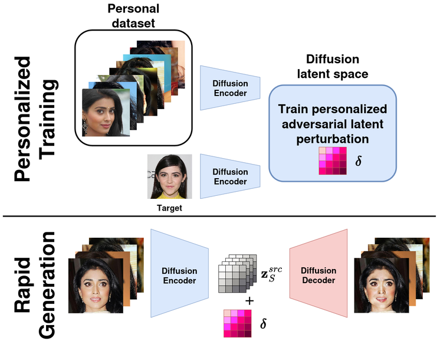
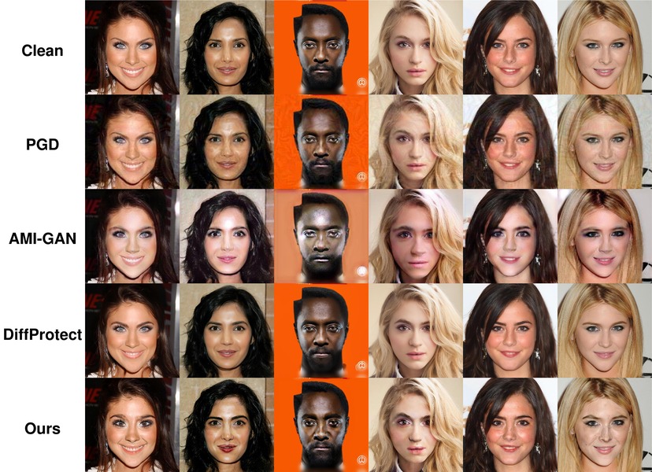

# FastDiffFaceAttack
Code for thesis "Personalized Adversarial Perturbations for Facial Privacy Protection Using Latent Diffusion Models."



# Setup
1. Create and activate a virtual encironment with python 3.8.
```
conda create -n [env_name] python=3.8
conda activate [env_name]
```
2. To install dependencies, run the following commands in the root.
```
pip install torch==1.12.0+cu113 torchvision==0.13.0+cu113 torchaudio==0.12.0 --extra-index-url https://download.pytorch.org/whl/cu113
pip install -r requirements.txt
```

3. Download the pretrained face recognition model assets from the [DiffProtect](https://github.com/joellliu/DiffProtect) official page, then run the following command:
```
python get_fr_ckpt.py
```

4. To construct the full dataset, download the [CelebAMask-HQ](https://github.com/switchablenorms/CelebAMask-HQ) dataset from their official page and place the .zip file in the project root directory, then run the following command:
```
python get_dataset.py
```
The full dataset is unnecessary for the demo.

# Run the Code

Run the following command for the demo
```
python demo.py
```

Run a full training loop with
```
python main.py
```



